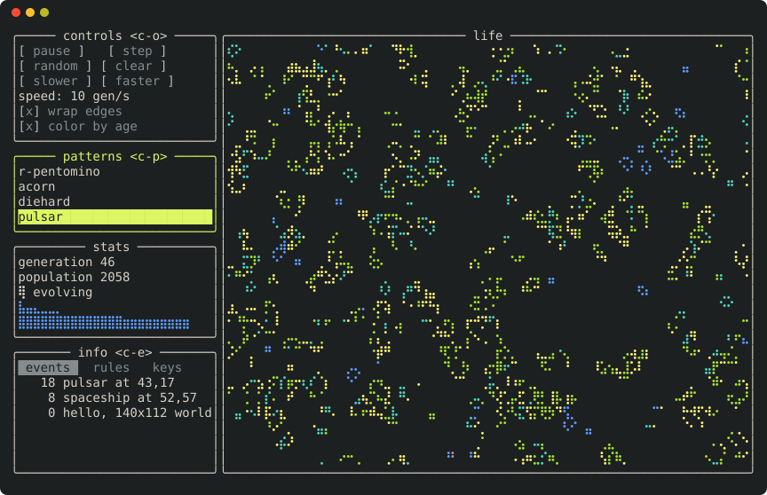

# xxx

Immediate mode text ui library for C++23. No dependencies: it talks to the terminal directly.
Earlier versions were built on [termbox/termbox2](https://github.com/termbox/termbox2), thanks to its authors.



## Features

- Immediate mode API: describe UI every frame, no widget objects to manage
- Event driven: frames are built on input, timeout or `wake_up()` from another thread; idle app uses no CPU
- Automatic layout: rows of `cells(n)`, `ratio(r)` or `fill()` wide columns, `same_line`
- Views with border, title and shortcut; fixed, fit-content or `fill()` height
- Scrolling: PgUp / PgDn, mouse wheel, auto-scroll to focused widget
- Widgets: label, button, checkbox, list, table, tabs, text input (password, readline keys, word motions), spinner, progress
- Clipboard via OSC 52 (works over ssh and in tmux): ctrl-c in inputs, lists and tables; readline kill / yank
- Modal popups drawn on top of everything, with input capture and focus restore
- Keyboard focus: arrows move to the nearest widget (also across views), Tab / Shift-Tab, `set_focus`
- Built-in help (F1 / ?) and context key hints; F1-F12, Ctrl / Alt / Shift modifiers, Alt+letter shortcuts and mouse (click to focus, press, place cursor)
- Id scopes (`push_id` / `pop_id`) for widgets built in loops
- Unicode aware: wide chars (CJK, emoji) take two cells
- Braille canvas: 2x4 "pixels" per cell
- Themes by role (text, accent, focus, selection, error, ...): the default one uses the terminal's own 16 colors,
  so it reads well on light and dark schemes; `set_style` / `use_theme`, `push_style` / `scoped_style` for single
  widgets; 16 / 256 / 24-bit colors as the terminal supports (`COLORTERM`), `NO_COLOR` respected.
  Loading themes from JSON files is shown in the mihomo example (`example/theme_file.h`), the library stays
  dependency free
- View frames (rounded, plain, thick, double) for inactive / active views, titles left, center or right
  (`set_view_style`); labels made of styled parts (`label({{"q", im_role::text, im_attr_bold}, {" quit"}})`);
  table rows with their own role and a gap under the header (`im_table_options`); optional j / k / g / G
- Headless backend for testing UI without a terminal
- Debug builds mark widgets with colliding ids (same label twice) with a red `!`

## Example

```cpp
#include <xxx.h>

int main() {
  xxx::init();
  auto name = std::string();
  auto agree = false;
  while (true) {
    // sleep until input arrives: no CPU spent while nothing happens
    xxx::process_input_events(xxx::wait_forever);
    if (xxx::is_key_pressed(xxx::im_key_id::ctrl_q)) {
      break;
    }
    xxx::new_frame();
    xxx::view_begin("hello");
    xxx::text_input("your name", name);
    xxx::checkbox("I like terminals", agree);
    if (xxx::button("greet")) {
      // ...
    }
    xxx::view_end();
    xxx::render();
  }
  xxx::shutdown();
}
```

[`example/life.cpp`](example/life.cpp) is Conway's Game of Life (screenshot above):
play / pause, speed, patterns table, population chart, event log and help in tabs, confirmation popup.

```sh
cmake -B build && cmake --build build
./build/example/life
```

[`example/myip.cpp`](example/myip.cpp) asks several "what is my IP" services in different domain zones at
once and shows each answer as it arrives; errors are red, addresses that differ from the majority are yellow.

[`example/mihomo.cpp`](example/mihomo.cpp) is a dashboard for [mihomo](https://github.com/MetaCubeX/mihomo)
(Clash.Meta) through its RESTful API over http or https: traffic, proxy groups (select a proxy, test
delays) and connections (close them). It also loads colors from a JSON theme file (`--theme FILE`). It shows how to combine the UI with network: background threads
do the requests and call `xxx::wake_up()` when new data arrives, the UI thread sleeps in
`process_input_events(wait_forever)` and never blocks on the network.

```sh
# needs libcurl (e.g. apt install libcurl4-openssl-dev); nlohmann_json and cxxopts come with CPM
./build/example/mihomo -u https://127.0.0.1:9090 -s "$SECRET" --cacert controller.crt
```

## Your own event loop

By default `process_input_events(timeout)` waits for input itself. An application with its own event loop
(poll, epoll, kqueue, asio, libuv, ...) owns an `xxx::terminal` instead and waits on its descriptors together
with its own; the library then never waits. [`example/poll_loop.cpp`](example/poll_loop.cpp) multiplexes the
terminal and a pipe in one `poll()` in one thread:

```cpp
auto term = xxx::terminal();   // raw mode, alternate screen; restored on destruction and fatal signals
xxx::init(term);
while (true) {
  pollfd fds[] = {{term.input_fd(), POLLIN, 0}, {term.notify_fd(), POLLIN, 0}, /* your own fds */};
  poll(fds, std::size(fds), term.timeout_ms());   // timeout: only while a lone Esc is being resolved
  term.read_available();
  term.check_timeout();
  xxx::process_input_events();                    // takes the queued events, never waits
  // ... build ui, xxx::render()
}
```

Events can also be read without the UI: `term.next_event(event)` gives keys, text, mouse and resizes in order.

Completion based loops (io_uring, asio `async_read`) read the terminal themselves and hand the bytes over;
frames are written asynchronously, one at a time, the latest frame goes after the write in flight.
[`example/uring_loop.cpp`](example/uring_loop.cpp) runs input, `signalfd`, timers and frame writes as
io_uring completions:

```cpp
auto term = xxx::terminal({
    .handle_resize_signal = false,                     // SIGWINCH via signalfd -> term.notify_resize()
    .write = [&](std::string_view bytes) { /* submit a write; bytes stay valid until write_done() */ },
});
// completions:
term.feed({buffer, n});                                // input read by the application
term.write_done(n);                                    // a frame write finished
term.check_timeout();                                  // timer armed with term.timeout_ms()
```

## Terminal support

The library talks to the terminal directly (no curses, no terminfo) and works with xterm compatible
terminals: practically every modern one (xterm, GNOME Terminal, Konsole, iTerm2, kitty, WezTerm,
Alacritty, Windows Terminal over ssh, tmux, screen). It uses bracketed paste (pasted newlines don't
press Enter), synchronized output (no flicker) and restores the terminal even when the app is killed
by a signal or crashes.

Environment:

- `ESCDELAY=ms`: how long a lone Esc waits for the rest of a key sequence (default 25, raise it for slow ssh links)

## Testing

UI is tested with the headless backend: build a frame, compare the screen.

```cpp
TEST_CASE("button") {
  headless_app app(im_vec2(20, 3));
  app.frame([] {
    view_begin("main");
    button("ok");
    view_end();
  });
  CHECK(app.screen() == dedent(R"(
    ╭────── main ──────╮
    │  [ ok ]          │
    ╰──────────────────╯
  )"));
}
```

```sh
cmake -B build && cmake --build build && ctest --test-dir build
```
